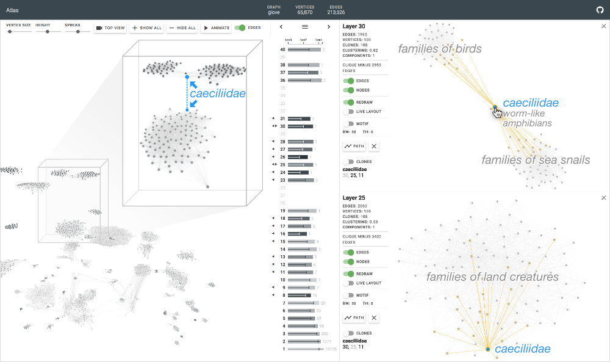

# Atlas

*Atlas: Local Graph Exploration in a Global Context*

Atlas is an interactive graph exploration system that wields a fast and scalable edge decomposition algorithm, based on iterative vertex-edge peeling, that decomposes million-edge graphs in seconds, scaling to graphs with up to hundreds of millions of edges. Atlas introduces a new approach for exploring large graphs that simultaneously reveals (1) peculiar subgraph structure discovered through the decomposition’s layers, (e.g., quasi-cliques), and (2) possible vertex roles in linking such subgraph patterns across layers.

For the Atlas edge decomposition algorithm, go to [github.com/fredhohman/atlas-algorithm][atlas-algorithm].




***


## Installation

Download or clone this repository:

```bash
git clone https://github.com/fredhohman/atlas.git
```

Within the cloned repo, install the required packages with npm:

```bash
npm install
```


## Usage

To run Atlas:

```bash
npm run start
```

## Using Your Own Graph Data

To load your own graph data into Atlas, [see the instructions here][own-data].


### Requirements

Atlas requires [npm][npm] to run.


## Atlas Edge Decomposition Algorithm

Atlas uses a fast, scalable edge decomposition to split graphs into graph layers for visualizaion.
For the edge decomposition algorithm, go to [github.com/fredhohman/atlas-algorithm][atlas-algorithm].


## Citation

**Atlas: Local Graph Exploration in a Global Context**. 
James Abello*, Fred Hohman*, Varun Bezzam, Duen Horng (Polo) Chau  
ACM Conference on Intelligent User Interfaces (IUI). Los Angeles, CA, USA, 2019. 
\* Authors contributedg equally.

```
@inproceedings{hohman2019atlas,
  title={Atlas: Local Graph Exploration in a Global Context},
  author={Abello, James and Hohman, Fred and Bezzam, Varun and Chau, Duen Horng},
  booktitle={Proceedings of the International Conference on Intelligent User Interfaces},
  year={2019},
  organization={ACM}
}
```

## License

MIT License. See [`LICENSE.md`](LICENSE.md).


## Contact

For questions or support [open an issue][issues] or contact [Fred Hohman][fred].


[atlas-algorithm]: https://github.com/fredhohman/atlas-algorithm
[npm]: https://www.npmjs.com
[fred]: http://www.fredhohman.com
[own-data]: data/README.md
[issues]: https://github.com/fredhohman/atlas/issues